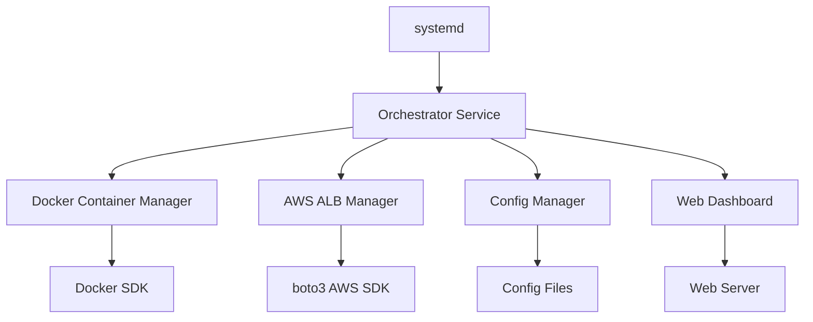

# 🛠️ Design Document: MCP Docker Orchestrator with ALB Integration
## 📌 Overview

This service is a systemd-managed daemon that:

1. Reads a `mcp.config.json` configuration file describing a set of MCP (model context protocol) servers as Docker services.
2. Launches each described MCP as a Docker container.
3. Automatically sets up AWS ALB path-based routing for each MCP container.
4. Ensures containers are reachable via distinct paths (e.g. `/mcp/github`) through a single ALB.
5. Provides no persistence of secrets—auth/session tokens are expected to be passed at runtime via LiteLLM and so deployments are made in that way.

---

## 🎯 Objectives

* Dynamically manage Docker MCP containers based on a `mcp.config.json` config file (standard mcp servers configuration).
* Automatically configure ALB routing rules (path-based) for each MCP service.
* Ensure clean container lifecycle (start, stop, restart, health checks).
* Fully compatible with LiteLLM Proxy as upstream request forwarder.
* Retrieve settings variables like ALB ARN from settings.conf.
* On service restart, check for changes in configuration files and configure only newly added resources while maintaining existing resources.
* Run as a control plane orchestrating and maintaining the MCP servers.
* Provide a web dashboard served at the `/monitor` path of the same ALB with basic authentication.
* Run as a systemd service on a Linux host (e.g., EC2).
* Be idempotent and self-healing (auto-reconcile).

## 🚀 Implementation Phases

### Phase 1: Core Container Orchestration
1. **Basic Python project setup**
   - Implement orchestrator.py as the main service
   - Set up structured logging configuration
   - Parse mcp.config.json and settings.conf

2. **Docker container management**
   - Container lifecycle management using Docker SDK
   - Status monitoring and reconciliation
   - Environment injection from configuration

### Phase 2: AWS ALB Integration
1. **ALB routing configuration**
   - Target group creation for each MCP service
   - Path-based routing rules setup
   - Health check endpoint configuration

2. **Port management**
   - Automatic port assignment to avoid conflicts

### Phase 3: Monitoring Dashboard
1. **Web dashboard at `/monitor`**
   - Basic username/password authentication
   - Container status visualization
   - ALB configuration display
   - Log viewing capabilities

## 🏗️ Architecture


---

## 📂 File Structure

```
mcp-orchestrator/
├── orchestrator/
│   ├── __init__.py
│   ├── main.py              # entry point for the service
│   ├── container_manager.py # Docker container management
│   ├── alb_manager.py       # AWS ALB integration
│   ├── config_manager.py    # Configuration handling
│   ├── dashboard/           # Web dashboard components
│   │   ├── __init__.py
│   │   ├── app.py           # Dashboard web application
│   │   ├── auth.py          # Basic authentication
│   │   └── templates/       # Dashboard HTML templates
│   └── utils/
│       ├── __init__.py
│       └── logging.py       # Logging configuration
├── mcp.config.json          # MCP service definitions
├── settings.conf            # Service settings
├── service.template         # systemd unit template
├── setup.sh                 # Sets up the systemd process
├── requirements.txt         # Python dependencies
└── README.md                # Project documentation
```

---

## ⚙️ Core Responsibilities

### 🐳 Docker Container Management

* Read the config file and launch missing containers using the Docker SDK.
* Restart stopped containers.
* Remove orphan containers (not in config).
* Inject env variables from config into each container.
* Map internal container port to a fixed local port on the host.

### ☁️ AWS ALB Management (via boto3)

* Ensure an ALB listener rule is created per service.
* Rule should forward `/mcp/<name>/*` to a unique target group pointing to the EC2 instance and container port.
* Each target group should have a health check path (`/health`) and be associated with the container.
* Maintain proper rule priorities (auto-increment or config-defined).
* Clean up stale rules and target groups if a service is removed.

### 🔁 Service Lifecycle (systemd)

* Run as a background daemon.
* Reconciles config → container state → ALB state on start and periodically.
* Restart on failure.

---

## 🔐 Runtime Auth Expectations

* Secrets like GitHub tokens can be stored in config if there's no other choice based on how MCP servers are built.
* LiteLLM will pass tokens at runtime via Authorization headers when possible.
* MCP containers should be configured to accept tokens dynamically via HTTP headers when supported.
* The monitoring dashboard will use basic username/password authentication for admin access only.

---

## 🪛 Developer Instructions (Not strict - Just ideas)

### 🔹 Docker SDK (Python)

* Use `docker.from_env()` to manage containers.
* Launch containers with:

  ```python
  docker_client.containers.run(
      image,
      name=name,
      detach=True,
      ports={f"{port}/tcp": local_port},
      environment=env_dict,
      restart_policy={"Name": "always"},
      labels={"mcp_service": name}
  )
  ```

### 🔹 AWS SDK (boto3)

* ELB client: `elbv2 = boto3.client('elbv2', region_name=config['aws_region'])`
* Target group creation:

  ```python
  elbv2.create_target_group(Name="tg-github", Protocol="HTTP", Port=8080, VpcId="vpc-xxxx", TargetType="instance")
  ```
* Listener rule creation:

  ```python
  elbv2.create_rule(
    ListenerArn=listener_arn,
    Conditions=[{"Field": "path-pattern", "Values": ["/mcp/github/*"]}],
    Actions=[{"Type": "forward", "TargetGroupArn": tg_arn}],
    Priority=next_available_priority
  )
  ```

### 🔹 Health Check

* All MCP Docker images must expose `/health` for ALB health checks.

---

## 🧪 Testing

* Validate all services are running: `docker ps`
* Validate each `/mcp/<name>` path is reachable via ALB.
* Check `describe-rules` via AWS CLI to confirm listener rules.
* Confirm LiteLLM proxy calls correctly route and pass headers.

---

## 🧰 Error Handling & Recovery

* Log failures in container launches or ALB API calls.
* Must be idempotent—safe to re-run and self-correct.
* On config update or mismatch:

  * Add new containers
  * Stop/de-register old ones
  * Reconcile ALB routing

---

## 📈 Logging & Observability

* Structured logs with `json` or `logfmt`.
* Console output (systemd journal) and optional file logging.
* Container status and health check results displayed on monitoring dashboard.
* Standard error handling with appropriate retry mechanisms.

---

## 🧾 systemd Unit Template

```ini
[Unit]
Description=MCP Orchestrator Service
After=network.target docker.service

[Service]
ExecStart=/usr/bin/python3 /opt/mcp-orchestrator/orchestrator/main.py
WorkingDirectory=/opt/mcp-orchestrator
Restart=always
RestartSec=5
User=ec2-user
Environment=PYTHONPATH=/opt/mcp-orchestrator

[Install]
WantedBy=multi-user.target
```

---

## 🔄 Reconciliation Strategy

* Periodic checking of container health and ALB configuration
* Standard industry practices for retry logic and error handling
* Self-healing by automatically correcting discrepancies between desired and actual state
* Focus on idempotency to ensure safe re-runs

## ✅ Bonus Features (For Future Consideration)

* File-watcher to reload config on file changes (e.g. `watchdog`)
* Dynamic port mapping with host port pool management
* Slack/Discord notifier on failed service deployment
* Integration with SSM Parameter Store for secure secret fetch
* Container resource limits and monitoring

## 🛠️ Implementation Notes

* Use official Python libraries (Docker SDK, boto3) for core functionality
* Start with implementing and testing core Docker container management
* Progress to ALB integration only after container management is verified
* Add monitoring dashboard as the final phase
* Follow standard error handling practices with appropriate logging

---
